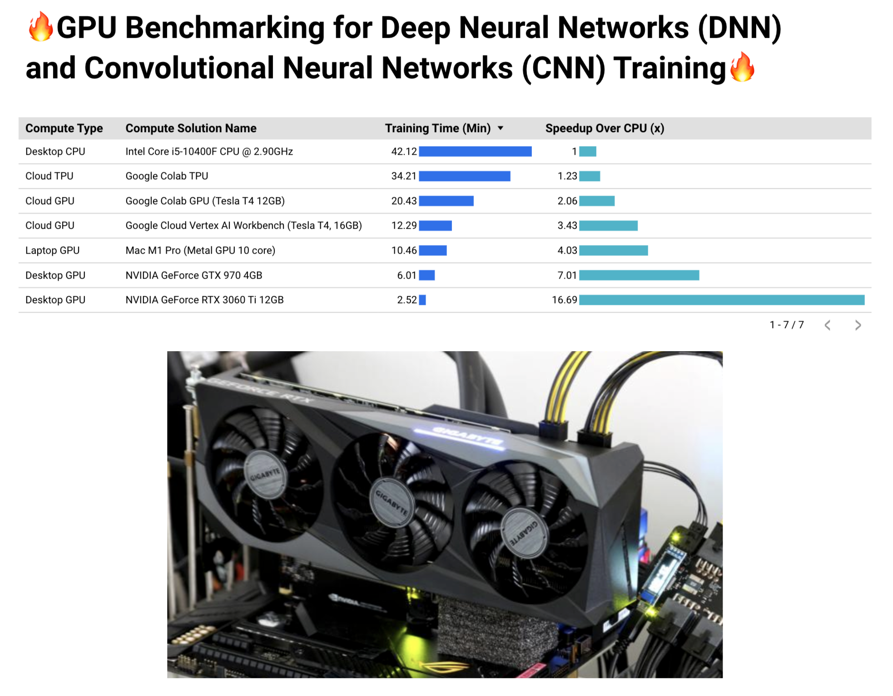

# Deep Learning Training Scenarios Benchmarking 👋🤖💻

👋 Hello #MachineLearning enthusiasts! 🤖💻

It's all about speed and efficiency when we're working with #DeepLearning models, right? 💨💡 Well, I've done a little experiment for fun, comparing the performance of different computing solutions, and I'm excited to share the results! 🧪📊

We all know the importance of fast, efficient computation in the interactive development of ML models using Jupyter notebooks - the heart of ML development. Let's check out how various devices stand up in this race, and also take a peek into the cost-effectiveness of these solutions. 🏎️💸

Here's the leaderboard! 🏁🥇

1️⃣ NVIDIA GeForce RTX 3060 Ti 12GB Desktop GPU: Coming in at just 2.52 minutes! 🚀 Speedup over CPU: 16.68x

2️⃣ NVIDIA GeForce GTX 970 4GB Desktop GPU: A respectable 6 minutes. Speedup over CPU: 7.01x

3️⃣ Mac M1 Pro (Metal GPU 10 core) Laptop GPU: Finishing at 10.46 minutes. Speedup over CPU: 4.03x

4️⃣ Google Cloud Vertex AI Workbench (Tesla T4, 16GB) Cloud GPU: Stepping in at 12.29 minutes. Speedup over CPU: 3.43x

5️⃣ Google Colab GPU (Tesla T4 12GB) Cloud GPU: A bit behind at 20.43 minutes. Speedup over CPU: 2.06x

6️⃣ Google Colab TPU Cloud TPU: Trailing at 34.21 minutes. Speedup over CPU: 1.23x

7️⃣ Intel Core i5-10400F CPU @ 2.90GHz Desktop CPU: Our baseline at 42.12 minutes.

Now, let's compare cost-effectiveness 💰🔍

The RTX 3060 Ti Desktop GPU, our champion, costs around $289.99. On the other hand, using the Google Cloud Vertex AI Workbench, with a Tesla T4 16GB GPU, comes in at around $160 per month (8 hours/day, 20 days/month).

So, depending on your workload, different solutions could be more cost-effective. For those looking to experiment and innovate swiftly and economically, these findings might help!

I hope this sparks some thought about the relationship between cost and efficiency in your #MLModelDevelopment process. 💭💡

P.S. You can find the detailed analysis and Jupyter notebooks on the GitHub repo linked in the comments. Happy innovating! 🎉🚀

Remember, this is just about ML development, not ML production-grade training. Different solutions for different stages! 😉📈



Detailed results can be found in the LinkedIn post linked [here](link_to_your_post). 

## 📊 Benchmarking Code

The code in this repository is written in Python, using TensorFlow for model training.

The benchmark uses a simple Convolutional Neural Network (CNN) model to classify images of cats and dogs, which serves as a representative example of a deep learning model. The code records and prints the time it takes to train this model using different hardware setups.

Here is a brief rundown of the code:

1. **Data Preparation**: The code begins by importing necessary libraries and defining the directories where the training and test datasets reside. The images are then loaded and rescaled.

2. **Model Definition**: The code defines a CNN model with three convolutional layers and two fully-connected layers.

3. **Model Compilation**: The model is compiled with RMSprop optimizer, binary cross entropy as the loss function, and accuracy as the metric.

4. **Model Training**: The model is trained on the training data for 15 epochs and validated on the validation data. The training time is recorded and printed.

5. **Model Evaluation**: The trained model's performance is evaluated on the validation set, and the model is saved for future use.

6. **Visualizing Training and Validation Metrics**: The training and validation accuracy and losses are plotted against the number of epochs.

## 📚 Installation
Before running the script, you need to have the following libraries installed:

`pip install tensorflow matplotlib`

## Usage
Download and upzip the Dataset

```
wget https://storage.googleapis.com/data-lake-bucket-new/cat-vs-dogs-kaggle.zip
unzip cat-vs-dogs-kaggle.zip
```

Set the directories of your training and validation (or test) datasets in the following lines of code:

# Code Explanation
The script is divided into several sections:

## Importing Libraries

```python
import tensorflow as tf
from tensorflow.keras.preprocessing.image import ImageDataGenerator
import time
import matplotlib.pyplot as plt
```

## Preparing the Data
The images are loaded from the specified directories. 

```python
# Define directories
train_dir = '/<path-to-your-unzip-dataset>/cat-vs-dogs-kaggle/train/'
test_dir = '/<path-to-your-unzip-dataset>/cat-vs-dogs-kaggle/test/'
```

# `tensorflow.keras.preprocessing`

ImageDataGenerator, flow_from_directory, and image normalization and resizing of `tensorflow.keras.preprocessing` is some important concepts for working with image data. . Let's break down each one:

## **ImageDataGenerator**:

This is a utility in TensorFlow's Keras API that makes it easy to load, preprocess, and augment image data. It's useful when working with large datasets that don't fit into memory. By using ImageDataGenerator, you can efficiently create batches of images on-the-fly while training a model.

## **flow_from_directory**:

This is a method of ImageDataGenerator that allows you to load images directly from a directory structure, and automatically label the images based on the sub-directory in which they are found.

```python
# Flow training images in batches of 20 using train_datagen generator
train_generator = train_datagen.flow_from_directory(
    train_dir,  # This is the source directory for training images
    target_size=(150, 150),  # All images will be resized to 150x150
    batch_size=20,
    # Since we use binary_cross entropy loss, we need binary labels
    class_mode='binary')

# Flow validation images in batches of 20 using test_datagen generator
validation_generator = test_datagen.flow_from_directory(
    test_dir,
    target_size=(150, 150),
    batch_size=20,
    class_mode='binary')
```


## **Rescaling**:

As you described, this is a way to normalize the pixel values of an image. By rescaling the pixel values to a range of 0 to 1, you can help the model converge during training.

```
# All images will be rescaled by 1./255
train_datagen = ImageDataGenerator(rescale=1./255)
test_datagen = ImageDataGenerator(rescale=1./255)
```

## **Resizing**:

Images come in a variety of sizes. However, the input to a neural network needs to be a fixed size. As such, it's common to resize all images to a fixed size so they can be input to the network.

In the context of a binary classification problem, like distinguishing between horses and humans, these tools are very handy. They allow you to prepare your image data for training a model with relative ease.


The code is focused on training a Convolutional Neural Network (CNN) model to classify images of cats and dogs. Let's break down the code and explain each section:

1. Importing Libraries:
    - TensorFlow: A popular deep learning framework.
    - ImageDataGenerator: A utility class for image data preprocessing.
    - time: A module to measure the execution time of the code.
    - matplotlib.pyplot: A library for data visualization.
2. Downloading and Preparing the Dataset:
    - The code assumes that you have already downloaded and unzipped a dataset containing images of cats and dogs.
    - The paths to the training and validation (or test) directories are defined using the **`train_dir`** and **`test_dir`** variables.
3. Preprocessing the Images:
    - The **`ImageDataGenerator`** class is used to apply preprocessing operations to the images.
    - The images are rescaled by dividing each pixel value by 255, which normalizes them to the range [0, 1].
    - This rescaling ensures that the input values are within a reasonable range for the neural network.
    - The **`ImageDataGenerator`** is configured separately for the training and validation data.
4. Creating the Data Generators:
    - The **`flow_from_directory`** method of the **`ImageDataGenerator`** class is used to generate batches of training and validation data.
    - The **`train_generator`** is created using the training directory, specifying the target size of the images (150x150 pixels), and setting the batch size to 20.
    - The **`validation_generator`** is created similarly for the validation data.
5. Defining the Model:
    - The CNN model is defined using the **`Sequential`** class from TensorFlow.
    - The model consists of three pairs of convolutional (**`Conv2D`**) and max pooling (**`MaxPooling2D`**) layers.
    - These layers help the model learn and capture important patterns in the images.
    - The output of the last convolutional layer is flattened and fed into a fully connected (**`Dense`**) layer with 512 neurons and ReLU activation.
    - Finally, a single output neuron with sigmoid activation is used to classify the images as either cats or dogs.
6. Compiling and Training the Model:
    - The model is compiled using the **`RMSprop`** optimizer with a learning rate of 0.001.
    - The loss function is set to **`binary_crossentropy`**, suitable for binary classification tasks.
    - The model is trained using the **`fit`** method, where the **`train_generator`** is used as the training data and the **`validation_generator`** is used for validation.
    - The training is performed for 15 epochs, and the progress is displayed.
7. Evaluating the Model:
    - After training, the model is evaluated using the **`evaluate`** method on the validation data.
    - The loss and accuracy values are printed.
8. Saving the Model:
    - The trained model is saved to a specified location on disk using the **`save`** method.
9. Visualizing Training Progress:
    - The accuracy and loss values for both the training and validation sets are extracted from the training history.
    - Matplotlib is used to plot the accuracy and loss curves over the epochs.
10. Model Summary:
    - The model summary is printed, providing an overview of the layers, their output shapes, and the number of parameters in the model.

Overall, this code trains a CNN model to classify images of cats and dogs using a dataset, applies preprocessing to the images, defines the model architecture, trains the model, evaluates its performance, and saves the trained model. It also visualizes the training progress using accuracy and loss curves.